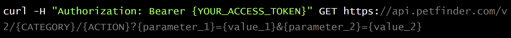
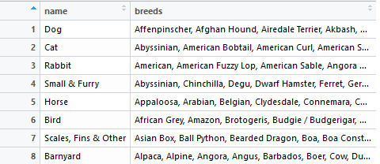

```{r setup, include=FALSE}
knitr::opts_chunk$set(echo = FALSE, fig.align = "center")
library(tidyverse)
library(gridExtra)
library(magick)
library(hexSticker)
library(showtext)
library(knitr)
library(cowplot)
```

```{r include = FALSE}
sticker <- image_read('https://raw.githubusercontent.com/earl88/PetFindr/master/man/figures/logo.png')
```

# Petfinder.com 

```{r, out.width = "100%"}
knitr::include_graphics("images/petfinder-website.PNG")
```

---

# Petfinder.com 

```{r, out.width = "100%"}
knitr::include_graphics("images/petfinder-dogs.PNG")
```

---

# The Petfinder API (V2)

* https://www.petfinder.com/developers/v2/docs/

* New version requires sign-up to receive 'key' and 'secret'

* Conduct searches using 'curl' (client url) on the command line

* Responses are in JSON format

* List search options (available animal types, breeds, etc.)

* Search pets and organizations by type, location, id, and more <br/><br/><br/>

```{r, out.width = "40%"}

```

---

# PetFindr

https://github.com/earl88/PetFindr

```{r, out.width = "100%", fig.align = "center"}
knitr::include_graphics("../../man/figures/logo.png")
```

---

# Interacting with the API

* Package `httr` by Hadley Wickham

    + `GET`, `POST`, `add_headers`, `content`, `status_code`
    
* Endpoint: https://api.petfinder.com/v2/

* Request token

```{r, out.width = "100%", fig.align = "center"}

```

* Make a search

```{r, out.width = "100%", fig.align = "center"}

```


---

background-image: url(https://raw.githubusercontent.com/earl88/PetFindr/master/inst/FinalPresentation/images/logo1.jpg)
background-size: 150px
background-position: 98% 8%

### Getting Started (Authentication)
#### Jess

To guide users in the authentication process, 
`pf_setup` is there for you.


First, let's install the package!

```{r, eval = F, echo = T}
devtools::install_github("earl88/PetFindr")
library(PetFindr)
```

You need a Petfinder account.  

```{r, eval = F, echo = T}
pf_setup()
```


```{r  out.width = "90%",echo=FALSE}
knitr::include_graphics("https://raw.githubusercontent.com/earl88/PetFindr/master/inst/FinalPresentation/images/setup_message.png")
```

---
background-image: url(https://raw.githubusercontent.com/earl88/PetFindr/master/inst/FinalPresentation/images/logo1.jpg)
background-size: 150px
background-position: 98% 8%

### Getting Started (Authentication)

Once you create an account, you will be assigned a unique `key` and `secret`.

```{r  out.width = "85%",echo=FALSE}
knitr::include_graphics("https://raw.githubusercontent.com/earl88/PetFindr/master/inst/FinalPresentation/images/register.png")
```

---
background-image: url(https://raw.githubusercontent.com/earl88/PetFindr/master/inst/FinalPresentation/images/logo1.jpg)
background-size: 150px
background-position: 98% 8%

### Getting Started (Authentication)

Once you create an account, you will get assigned a unique `key` and `secret`.

```{r  out.width = "85%",echo=FALSE}
knitr::include_graphics("https://raw.githubusercontent.com/earl88/PetFindr/master/inst/FinalPresentation/images/getanapi.png")
```


---
background-image: url(https://raw.githubusercontent.com/earl88/PetFindr/master/inst/FinalPresentation/images/logo1.jpg)
background-size: 150px
background-position: 98% 8%

### Getting Started (Authentication)

Once you create an account, you will get assigned a unique `key` and `secret`.
```{r  out.width = "85%",echo=FALSE}
knitr::include_graphics("https://raw.githubusercontent.com/earl88/PetFindr/master/inst/FinalPresentation/images/secretandkey.png")
```

These values can be saved to your .Rprofile for future use.

```{r, echo = T, eval = F}
petfindr_key <- "paste_key_here"
petfindr_secret <- "paste_secret_here"
pf_save_credentials(key = petfindr_key, secret = petfindr_secret)
```


---
background-image: url(https://raw.githubusercontent.com/earl88/PetFindr/master/inst/FinalPresentation/images/logo1.jpg)
background-size: 150px
background-position: 98% 8%

### Getting Started (Authentication)

With your `key` and `secret`, you can request an access token for the API database.

But what is a token?

- A credential that can be used to receive information 
- Structure

```{r, eval = F, echo = T}
pf_accesstoken <- function(key = NULL, secret = NULL) {
  if (is.null(key) || is.null(secret)) {
    stop("You must provide both a key and a secret to receive an access token. Please run 'pf_setup()' for more information.")
  }
  auth <- POST(url = "https://api.petfinder.com/v2/oauth2/token",
                     body = list(grant_type = "client_credentials",
                                 client_id = key, client_secret = secret),
                     encode = "json")
  if (auth$status_code != 200) {stop(pf_error(auth$status_code))}
  accesstoken <- content(auth)$access_token
  message("Your access token will last for one hour. After that time, you will need to generate a new token.\n")
  return(accesstoken)
}

```
---
background-image: url(https://raw.githubusercontent.com/earl88/PetFindr/master/inst/FinalPresentation/images/logo1.jpg)
background-size: 150px
background-position: 98% 8%

### Getting Started (Authentication)

```{r,eval = F, echo = T}
token <- pf_accesstoken(petfindr_key, petfindr_secret)
```

Your access token will last for one hour.

```{r  out.width = "95%",echo=FALSE}
knitr::include_graphics("https://raw.githubusercontent.com/earl88/PetFindr/master/inst/FinalPresentation/images/tokenmessage.png")
```

Now you are all set. Let's find pets!

```{r, eval = F, echo = F}
pf_list_breeds(token, type = "cat") %>% head(n = 20)
```

```{r  out.width = "60%",echo=FALSE}
knitr::include_graphics("https://raw.githubusercontent.com/earl88/PetFindr/master/inst/FinalPresentation/images/chowchow.gif")
```

---
background-image: url(https://raw.githubusercontent.com/earl88/PetFindr/master/man/figures/logo1.png)
background-size: 150px
background-position: 98% 8%


### Package functions  
#### Amin Shirazi

* Available information for each type of pet 
  * breed
  * age
  * coat
  * color
  * gender
  * size
  * ...

---
background-image: url(https://raw.githubusercontent.com/earl88/PetFindr/master/man/figures/logo1.png)
background-size: 150px
background-position: 98% 8%

### Package functions  

* What types of pets are available?

```{r   out.width = "70%",echo=FALSE, warning = FALSE, , message = FALSE}
p1 <- ggdraw() + draw_image(image =  "./images/list.type.2.jpg", scale = 1.2)
p2 <- ggdraw() + draw_image(image =  "./images/list.type.4.jpg", scale = 1)
p3 <- ggdraw() + draw_image(image =  "./images/list.type.3.jpg", scale = 1)
p4 <- ggdraw() + draw_image(image =  "./images/list.type.6.jpg", scale = 0.9)

plot_grid(p1, p2, p3, p4)
```

---
background-image: url(https://raw.githubusercontent.com/earl88/PetFindr/master/man/figures/logo1.png)
background-size: 150px
background-position: 98% 8%

### Package functions  
#### `pf_list_types(token)`

 * Input: token
 * Output: a tibble of all available animal types with their respective coat, color, and gender options
 
```{r out.width = "100%",echo=FALSE}
data("pf_types", package = "PetFindr")
pf_types
```
 
---
background-image: url(https://raw.githubusercontent.com/earl88/PetFindr/master/man/figures/logo1.png)
background-size: 150px
background-position: 98% 8%

### Package functions  
#### `pf_list_breeds(token, type)`

 * A list of all available breeds of each pet
   
   * Input: token, type of animal
   
   * Output: A character vector of the available breeds for the specified animal type
   
---

background-image: url(https://raw.githubusercontent.com/earl88/PetFindr/master/man/figures/logo1.png)
background-size: 150px
background-position: 98% 8%

### Package functions  
#### `pf_list_breeds`

```{r out.width = "110%",echo=FALSE}
data("pf_breeds", package = "PetFindr")

#pf_breeds

```

---

background-image: url(https://raw.githubusercontent.com/earl88/PetFindr/master/man/figures/logo1.png)
background-size: 150px
background-position: 98% 8%
### Package functions  
#### Searching for pets
##### `Pf_find_pets`
.pull-left[
* A data frame of pets info listed on Petfinder.com

* Filter searches
  * Animal type
  * Breed
  * Size
  * Gender
  * Age
  * Color
  * Location
  * ...
  
* Sort information
  * Recent information
  * Distance from the user
  ]
.pull-right[
```{r out.width = "100%",echo=FALSE}
knitr::include_graphics(path = "./images/find.pets.3.png")
```
]
---
background-image: url(https://raw.githubusercontent.com/earl88/PetFindr/master/man/figures/logo1.png)
background-size: 150px
background-position: 98% 8%
### Package functions  
#### Searching for pets
##### `Pf_find_pets`

`pf_find_pets(token)`

`pf_find_pets(token, type = "horse")`

`pf_find_pets(token, type = "dog", age = "baby", page = 1:5)`

`pf_find_pets(token, type = "Scales, Fins, & Others", breed = "Python", sort = "-rencent")`

---
background-image: url(https://raw.githubusercontent.com/earl88/PetFindr/master/man/figures/logo1.png)
background-size: 150px
background-position: 98% 8%
### Package functions  
#### Searching for pets
##### `Pf_find_pets`


```{r out.width = "112%",echo=FALSE}
#knitr::include_graphics(path = "./images/find.pets.png")
data("LA_puppies", package = "PetFindr")
names(LA_puppies)
```


---

background-image: url(https://raw.githubusercontent.com/earl88/PetFindr/master/man/figures/logo1.png)
background-size: 150px
background-position: 98% 8%
### Package functions  
#### Searching for pets
##### `Pf_find_pets`
##### Available puppies from the Los Angeles area
```{r, echo = T}
LA_puppies %>%  select("species", "breeds.primary","type", "age",
                       "gender","size", "name", "status",
                       "colors.primary", "coat" ) %>% head()
```

---
background-image: url(https://raw.githubusercontent.com/earl88/PetFindr/master/man/figures/logo1.png)
background-size: 150px
background-position: 98% 8%
### Package functions  
#### Visualization 
##### `pf_view_photos(animal_df, size)`

* View the photos of searched pets in a slideshow format

* Input: 
  * A data frame of animal search results from pf_find_pets
  * Photo size
      * Small
      * Medium
      * Large
      * Full

* Output: A slideshow of pet pictures

---
background-image: url(https://raw.githubusercontent.com/earl88/PetFindr/master/man/figures/logo1.png)
background-size: 150px
background-position: 98% 8%
### Package functions  
#### Visualization of photos
##### `pf_view_photos(token, size)`

```{r, echo=FALSE, warning=FALSE, message=FALSE}
knitr::include_graphics("https://media.giphy.com/media/Maz1hoeGskARW/giphy.gif")
```


