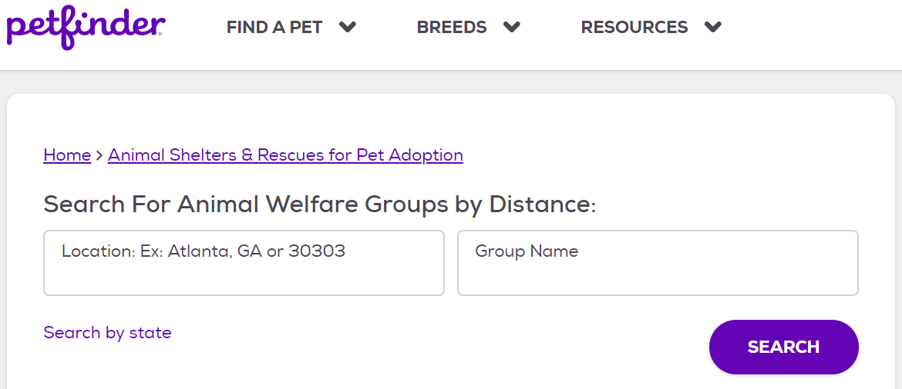

```{r setup, include=FALSE}
knitr::opts_chunk$set(echo = FALSE, fig.align = "center")
library(tidyverse)
library(gridExtra)
library(magick)
library(hexSticker)
library(showtext)
library(knitr)
library(cowplot)

```


```{r include = FALSE}
sticker <- image_read('https://raw.githubusercontent.com/earl88/PetFindr/master/man/figures/logo.png')
```

# Petfinder.com 

```{r, out.width = "100%"}
knitr::include_graphics("images/petfinder-website.PNG")
```

---

# Petfinder.com 

```{r, out.width = "100%"}
knitr::include_graphics("images/petfinder-dogs.PNG")
```

---

# The Petfinder API (V2)

* https://www.petfinder.com/developers/v2/docs/

* New version requires sign-up to receive 'key' and 'secret'

* Conduct searches using 'curl' (client url) on the command line

* Responses are in JSON format

* List search options (available animal types, breeds, etc.)

* Search pets and organizations by type, location, id, and more <br/><br/><br/>

```{r, out.width = "40%"}
knitr::include_graphics("images/petfinder-for-developers.PNG")
```

---

# PetFindr

https://github.com/earl88/PetFindr

```{r, out.width = "100%", fig.align = "center"}
knitr::include_graphics("../../man/figures/logo.png")
```


---

### Getting Started  -Name-


```{r echo = FALSE}
1+3
```

Research done by R.Fisman, S. Iyeangar et al (2006)

- One of the famous research done on Speed Dating

- Investigated gender differences in partner selection

- Focused on prediction with regression models


---
### Authentication  -Jessica-


- Subjects: Graduate students at Columbia University 

- 14 Speed dating sessions from 2002 - 2004 

- 4 minute interaction

```{r  out.width = "50%",echo=FALSE}


knitr::include_graphics("table.jpg", dpi = 50)
```

---

### Usage  -Jessica-


- Meow

---
### Functions  -Jessica-


- Meow


```{r, echo = FALSE, warning = FALSE, message = FALSE, fig.align='center', fig.width=12, fig.height = 8}

```
---
### Examples Using Sample Data  -Jessica-

- Meow
---
class: inverse

### Package functions  -Amin-


* What types of pets are available?

* What information is available of each type?
  * coat
  * color
  * gender


---

### Package functions  -Amin-
* What types of pets are available?
```{r   out.width = "70%",echo=FALSE, warning = FALSE, , message = FALSE}


p1 <- ggdraw() + draw_image(image =  "./images/list.type.2.jpg", scale = 1.2)
p2 <- ggdraw() + draw_image(image =  "./images/list.type.4.jpg", scale = 1)
p3 <- ggdraw() + draw_image(image =  "./images/list.type.3.jpg", scale = 1)
p4 <- ggdraw() + draw_image(image =  "./images/list.type.6.jpg", scale = 0.9)

plot_grid(p1, p2, p3, p4)

```

---
### Package functions  -Amin-

* What types of pets are available?


* Petfinder.com

```{r  out.width = "110%",echo=FALSE}
knitr::include_graphics(path = "./images/list.type.jpg")
```
 
---
### Package functions  -Amin-
* How to have a list of available pets in R?

```{r  out.width = "110%",echo=FALSE}
knitr::include_graphics(path = "./images/list.type.1.jpg")
```

---
class: inverse
### Package functions  -Amin-
#### pf_list_type
 * Input: token
 * Output: a tibble of all available animal types with their respective coat, color, and gender options
 
```{r out.width = "110%",echo=FALSE}
knitr::include_graphics(path = "./images/list.type_R_output.jpg")
```
 
---
class: inverse
### Package functions  -Amin-

 * What breeds are available for each pet?

#### pf_list_breed
 
 * A list of all available breeds of each pet
 * input: `token`, `type`
 * output: A character vector of the breed names


---
### Package functions  -Hana-
#### pf_find_organizations

* A function to find information of animal shelters and rescue groups. It returns a dataframe of details on a group of organizations based on criteria given in parameters.
  * https://www.petfinder.com/developers/v2/docs/#get-organizations

* What information is available?
  * id, name, and link for query
  * contact info. (email, phone, address, and social media)
  * page url in petfinder
  * photos
  * Adoption policy, website url, and etc.
  * e.g., https://www.petfinder.com/member/us/ia/ames/ames-animal-shelter-ia197/

---
### Package functions  -Hana-
#### pf_find_organizations
* How to search on petfinder
* https://www.petfinder.com/animal-shelters-and-rescues/search/

```{r, out.width = "100%"}

```

---
### Package functions  -Hana-
#### pf_find_organizations
* How to search on PetFindr

```{r, eval = F, echo = T}
pf_find_organizations <- function(token = NULL, name = NULL, 
                                  location = NULL, distance = NULL,
                                  state = NULL, country = NULL,
                                  sort = "recent", page = 1, limit = 20) {...}
```


```{r, echo = F, message = F}
#petfindr_key = "9XDk9x1IpkaRt0ebypatBNgF4zV9MeVkSjW1bDtiId8LWd2bPX"
#petfindr_secret = "eqU3FlGSfGsdvgKKSifJlLBB4wsxqzqvQJ9njHjX"

token <- PetFindr::pf_accesstoken(petfindr_key, petfindr_secret)
```

```{r, echo = T}
US_orgs <- PetFindr::pf_find_organizations(token, 
                                           country = "US", 
                                           limit = 10, 
                                           page = 1:3, 
                                           sort = "state")

IA_orgs <- PetFindr::pf_find_organizations(token, 
                                           location = "Ames, IA", 
                                           distance = 10, 
                                           sort = "-distance")
```

---
### Package functions  -Hana-
#### pf_find_organizations

```{r, echo = T, eval = T, out.width = "100%"}
IA_orgs %>%
  filter(name == "Ames Animal Shelter") %>%
  select(id, name, url, 
         address.address1, address.city, address.state,
         address.postcode, address.country,
         X_links.self.href, X_links.animals.href,
         photos.small)
```
---
### Package functions  -Hana-
#### pf_map_locations
* Input: token, a dataframe of pets returned from pf_find_pets
* Ouput: locations of organizations of pets on a Leaflet map
* How it works: Request location information by organizations' id that are extracted from a dataframe of individual pets
* https://www.petfinder.com/developers/v2/docs/#get-organization

```{r}
data(LA_puppies, package = "PetFindr")
PetFindr::pf_map_locations(token, LA_puppies[1,])
```

